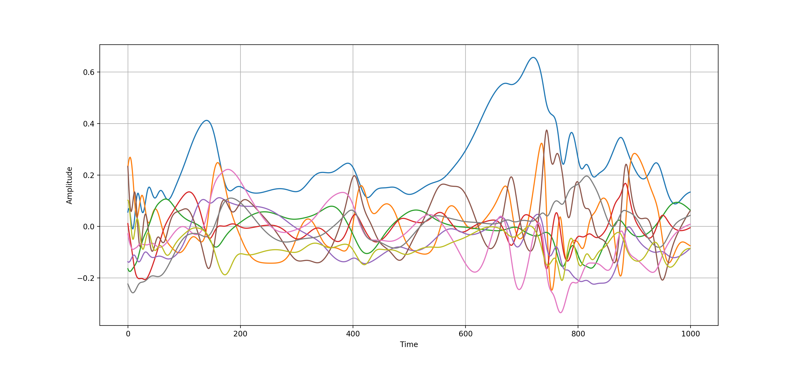

# Deriving the Nine-Mode-Model

We use **sympy** to derive the symbolic ordinary differential equations (ODE) for:

A low-dimensional model for turbulent shear flows  
https://iopscience.iop.org/article/10.1088/1367-2630/6/1/056

## Exemplary Output

Output will be the ODEs for the nine modes as a function of alpha, gamma and Re.
The transition to a numeric equation as well as a simple numeric solution are included as well.

A exemplary solution to the equations looks like:  

## License

This project is licensed under the MIT License - see the [LICENSE.md](LICENSE.md) file for details
